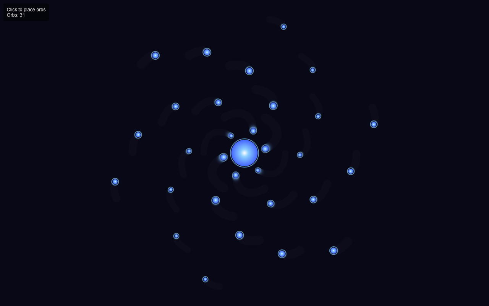
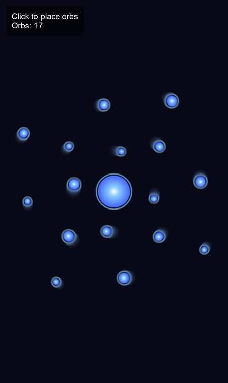

# Gravity Orb Simulator

A little physics sandbox in your browser: drop glowing orbs into space and watch gravity pull them into orbits, spirals and collisions.

**[▶ Open the live app](https://timothyhadfield.github.io/gravitational-orb-simulator/)** · best on a laptop with a mouse

  
  &nbsp;
  

## Features
- **Real n-body gravity** — every orb pulls on every other orb (inverse-square law), so orbits, slingshots and clusters happen on their own
- **Merging collisions** — orbs that touch combine into one bigger orb, keeping total mass and momentum
- **Throw orbs** — hold the mouse to spray a stream of orbs; drag while you hold and they launch with your mouse's speed and direction
- **Faster streams** — double-click and hold for 4x the spawn rate, triple-click for 9x
- **Heavy orbs** — Shift-click to drop orbs with 10x the mass
- **Zoom and pan** — scroll to zoom toward the cursor, right-click and drag to move around
- **Motion trails** — orbs leave fading streaks, and a live counter shows how many orbs are in play

## Controls
| Action | Control |
|---|---|
| Place orbs | Click (hold for a stream) |
| Throw orbs | Hold and drag |
| Faster stream | Double- or triple-click and hold |
| Heavy orbs | Shift + click |
| Zoom | Mouse wheel |
| Pan | Right-click + drag |

## Built with
Plain HTML, CSS and JavaScript (one `index.html` using the Canvas 2D API), hosted on GitHub Pages.
